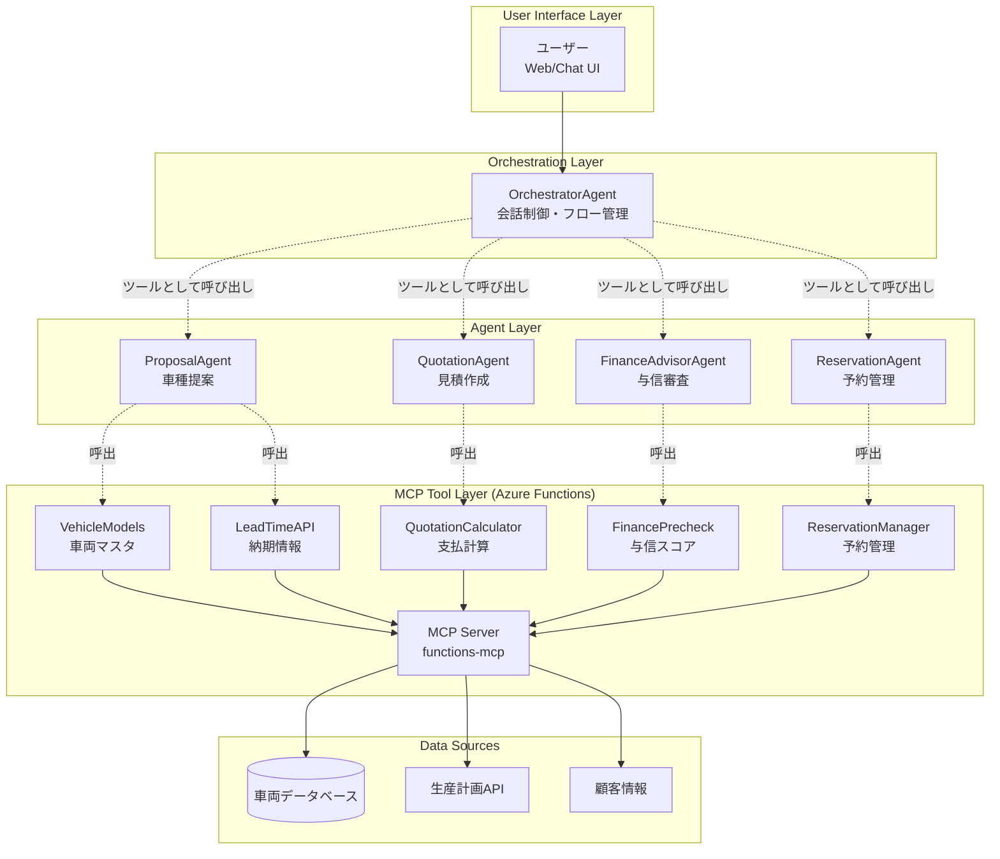
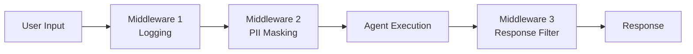
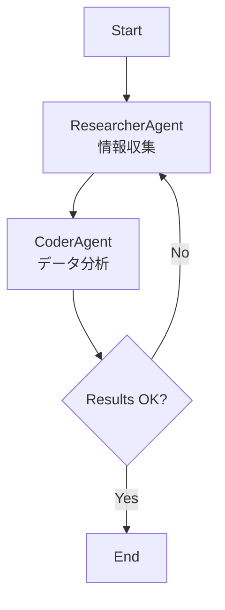
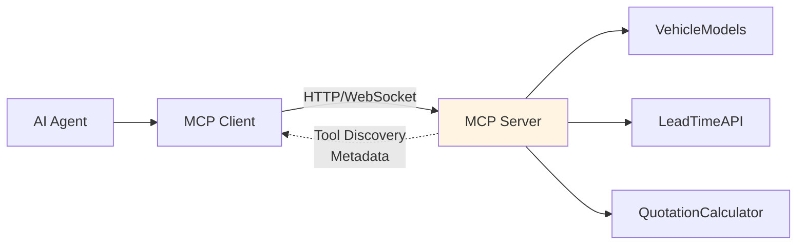
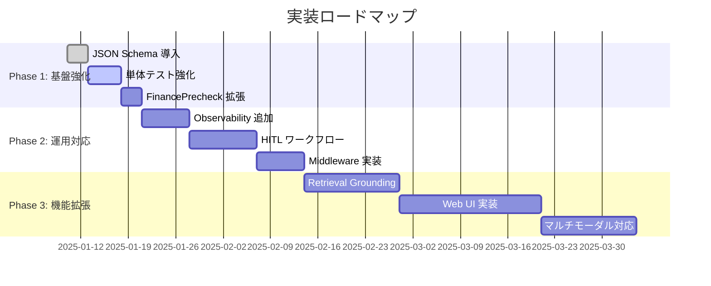

# はじめに
2025年10月に、MicrosoftからAgent Frameworkがリリースされました。従来、Microsoft関連のAIオーケストレーター層としてSemanticKernelとAutoGenがありました。これらを統合したFrameworkです。
https://learn.microsoft.com/ja-jp/agent-framework/overview/agent-framework-overview

概要について、詳しくはMicrosoftのdaka-sanのブログ記事をご覧ください。
https://zenn.dev/microsoft/articles/f0a05ba54a5df4

このブログでは、Azure Functions で MCPサーバを構築し、それらのツールを接続した、マルチエージェントな仕組みを、Microsoft Agent Frameworkで実装してみたので、その内容を紹介します。

# 動かしたもの

自動車購入を検討しているユーザーに対して、**車種提案 → 見積作成 → 与信審査 → 予約管理**まで対話形式で自動対応するマルチエージェントなシステムです。
各エージェントは、既存システムのAPIをMCPサーバ化したツールを呼び出して協調動作します。
※APIは仮実装であり、車両データや月額料金なども架空の設定です。

## 🎬 実行例
このような流れで動作します。
1. ユーザーが車の要件を入力します。
2. OrchestratorAgentが要件を解析し、各エージェントに処理を依頼します。
3. まず最初にProposalAgentが提案を作成します。
   1.  提案のために必要な車種リストをMCPツールから取得
   2.  車種リストとユーザ要件をもとに、推薦車種を絞り込み
   3.  ユーザに提案内容を返却
4.  次に、QuotationAgentが見積を作成します。
   1.  推薦車種の納期をMCPツールから取得
   2.  推薦車種の月額料金をMCPツールから取得
5.  最後に、FinanceAdvisorAgentが与信審査を行います。
   1.  ユーザーの年収・借入額をユーザにヒアリング
   2.  与信スコアをMCPツールから取得
   3.  契約可否をユーザに返却

```powershell
PS> python .\orchestrator_chat_repl.py --query "ワンボックスほど大きくない、スライドドアの車がいいなー" --budget-max=6000000 --verbose

00:18:37 - mcp.client.streamable_http - DEBUG - SSE message: root=JSONRPCResponse(jsonrpc='2.0', id=3, result={'content': [Json形式の車種情報]})

00:32:13 - agent_framework - DEBUG - Function result: {'recommendations': [{'model_id': 'VOXY', 'grade_id': 'VOXY-Z', 'engine_id': 'VOXY-Z-HV', 'vehicle_price': 3740000, 'reasons': ['スライドドア付きの車両です', '乗車人数4人に適しています', '予算内で収まり燃料効率が良好です'], 'est_lead_weeks': None}, {'model_id': 'SIENTA', 'grade_id': 'SIENTA-Z', 'engine_id': 'SIENTA-Z-HV', 'vehicle_price': 3108000, 'reasons': ['スライドドア付きのコンパクトミニバンです', 'ハイブリッド仕様で燃費が優れています', '予算内に収まり乗車人数に適しています'], 'est_lead_weeks': None}], 'normalized_requirements': {'budget_max': 6000000, 'passenger_count': 4, 'priority': 'balance', 'fuel_pref': 'hybrid'}, 'next_action_hint': None, 'metadata': {}}

00:32:29 - agent_framework - DEBUG - Function result: {'engine_id': 'VOXY-Z-HV', 'vehicle_price': 3740000.0, 'subscription_term_months': 36, 'monthly_fee': 64534.0, 'breakdown': {'base_fee': 63580.0, 'maintenance_fee': 0.0, 'taxes_and_fees': 954.0, 'discount_amount': 0.0}, 'total_cost': 2323224.0, 'rationale': [], 'metadata': {}}

00:32:32 - agent_framework - DEBUG - Function result: {'engine_id': 'SIENTA-Z-HV', 'vehicle_price': 3108000.0, 'subscription_term_months': 36, 'monthly_fee': 53629.0, 'breakdown': {'base_fee': 52836.0, 'maintenance_fee': 0.0, 'taxes_and_fees': 793.0, 'discount_amount': 0.0}, 'total_cost': 1930644.0, 'rationale': [], 'metadata': {}}

=== 初回応答 ===
トヨタの以下の2車種をおすすめします。

1. VOXY-Z (ハイブリッド)    
   - 月額料金: 64,534円
   - 契約期間: 36ヶ月

2. SIENTA-Z (ハイブリッド)
   - 月額料金: 53,629円
   - 契約期間: 36ヶ月

どちらもスライドドア付きで、予算内に収まります。さらに詳しくご検討されたい場合はお知らせください。

あなた> SIENTAがいいです！！

--- 応答 ---
素晴らしい選択です！トヨタのSIENTAは利便性が高く、燃費も良いお車です。

次は、必要に応じて与信審査を行います。以下の情報が必要ですので教えていただけますか：
- 年収
- 希望借入額

また、可能であれば以下の情報もご提供ください：
- 年齢
- 雇用形態
- 他の借入の有無と金額
- 扶養家族の数

あなた> 30歳会社員、ほかの借り入れはありません。扶養家族は二人です。

--- 応答 ---
ありがとうございます。それでは、年収と希望借入額を教えていただけますか？

あなた> 年収は700万です。借入額は全額で。

00:43:14 - agent_framework - DEBUG - Function result: {'score': 66, 'rating': 'AA', 'approved': True, 'annual_income': 7000000, 'requested_amount': 1000000, 'decision': None, 'factors': None, 'manual_review_reason': None, 'metadata': {'version': '1.0', 'source_tools': ['FinancePrecheck'], 'generated_at': '2023-11-03T13:30:46'}}

--- 応答 ---
新しい借入額での与信審査は無事に承認されました！トヨタのSIENTA、借入額100万円でのお手続きが可能です。

```
ちなみに、CLIで対話できるような実装は、AgentFrameworkに含まれてはいない認識です。対話CLIは独自実装です。

## システム概要

**4つの専門エージェント** が **5つのMCPツール** を呼び出してエージェンティックな動作をするようにしています。
さらに、4つの専門エージェントをツールとして呼び出す **OrchestratorAgent**（販売店エージェント的な存在）を用意し、ユーザはこのエージェントとだけ対話します。



### 📦 技術スタック

| レイヤー | 技術 | 役割 |
|---------|------|------|
| **Agent層** | Microsoft Agent Framework (Python) | マルチエージェント制御・会話管理 |
| **LLM** | Azure OpenAI (GPT-4o) | 自然言語理解と応答生成 |
| **MCP Server** | Azure Functions (Python v2) | ツール実装とMCPプロトコル対応 |
| **Protocol** | Model Context Protocol | エージェント⇔ツール間の標準通信 |
| **Interface** | CLI/REPL | 対話実行環境 |

---

# Microsoft Agent Framework の主要なコンポーネント
私はPythonを使っているので、PythonのAgentFrameworkのクラス名で解説します。

## ChatAgent（エージェント）

**ChatAgent**は、LLMとツールを統合したエージェントの基本単位です。
**ChatAgent が持つ機能**はこれらです。
- **Function Calling**: ツール関数を自動呼び出し
- **Multi-turn Conversation**: Thread による会話履歴管理
- **Streaming Response**: リアルタイム応答生成
- **Structured Output**: Pydantic モデルで型安全な出力

```python
from agent_framework import ChatAgent
from agent_framework.azure import AzureAIAgentClient
from azure.identity.aio import DefaultAzureCredential

# AI Client → Agent の流れ
async with DefaultAzureCredential() as credential:
    agent = AzureAIAgentClient(async_credential=credential).create_agent(
        name="HelperAgent",
        instructions="あなたは親切なアシスタントです。",
        tools=[get_weather]  # ツール関数を渡す
    )

    response = await agent.run("東京の天気はどうですか？")
    print(response.text)
```

## Tools（外部機能）

エージェントが呼び出せる関数を **Tools** として登録します。

ツールの種類はこれらがあります。今回の例ではMCP Toolsを使っています。
| ツールタイプ | 説明 | 用途 |
|-------------|------|------|
| **Custom Functions** | Python 関数 | 独自ロジックの実装 |
| **HostedCodeInterpreterTool** | コード実行環境 | データ分析・計算処理 |
| **HostedFileSearchTool** | ファイル検索 | RAG（検索拡張生成） |
| **MCP Tools** | Model Context Protocol | 外部サービス統合 |

天気取得ツールを例としてツール定義の実装例は以下です。

```python
from typing import Annotated
from pydantic import Field

def get_weather(
    location: Annotated[str, Field(description="天気を取得する場所")],
) -> str:
    """天気を取得する場所の天気を返します。"""
    # Your weather API implementation here
    return f"{location}の天気は晴れで、気温は25°Cです。"

# エージェントに登録
agent = ChatAgent(
    chat_client=OpenAIChatClient(),
    instructions="あなたは親切な天気アシスタントです。",
    tools=get_weather,  # ツールとして追加
)

result = await agent.run("東京の天気はどうですか？")
print(result.text)
```

## Middleware（エージェント実行の制御）

**Middleware** は、エージェント実行の各段階でフック処理を挟める仕組みです。

例えば、以下のような処理を挟み込めます。
- **リクエスト前**: ロギング、PIIマスキング、ツールホワイトリスト
- **レスポンス後**: 不適切な応答のフィルタリング


**Middleware の実装例**

```python
from agent_framework import AgentRunContext
from typing import Callable, Awaitable

async def logging_agent_middleware(
    context: AgentRunContext,
    next: Callable[[AgentRunContext], Awaitable[None]],
) -> None:
    """エージェント実行をログ出力するミドルウェアの例"""
    print("Agent starting...")
    
    # Continue to agent execution
    await next(context)
    
    print("Agent finished!")

# Middleware を追加
async with AzureAIAgentClient(async_credential=credential).create_agent(
    name="GreetingAgent",
    instructions="あなたは親切なアシスタントです。",
    middleware=logging_agent_middleware,  # ここで追加
) as agent:
    result = await agent.run("Hello!")
    print(result.text)
```

## Workflow（マルチエージェントオーケストレーション）

**Workflow** は、複数のエージェントや関数をグラフ構造で連携させる仕組みです。

ワークフローで定義できるので、**複雑な分岐やループも表現可能**です。実業務で決まった工程がある場合に有用だと思います。
実例だと TOYOTA O-beya の思想ですね。

https://devblogs.microsoft.com/cosmosdb/toyota-motor-corporation-innovates-design-development-with-multi-agent-ai-system-and-cosmos-db/」

Workflow の種類にはこれらがあります。

| パターン | 説明 | 図 |
|---------|------|-----|
| **Sequential** | 順次実行 | A → B → C |
| **Concurrent** | 並列実行 | A, B, C → 集約 |
| **Handoff** | 条件分岐 | A → 判定 → B or C |
| **Group Chat** | 協調対話 | A ↔ B ↔ C |

例えば以下のようなフローを定義できます。


Durable Functions みたいですね。Durable Functionsの場合は状態管理もされており、より堅牢なワークフローが実装できます。

**Workflow の実装例**

```python
from agent_framework.workflows import WorkflowBuilder

# エージェント作成
researcher = ChatAgent(
    name="ResearcherAgent",
    description="調査を行うエージェント",
    instructions="あなたはデータを調査し、分析結果を提供します。",
    chat_client=OpenAIChatClient()
)

coder = ChatAgent(
    name="CoderAgent",
    description="コードを書くエージェント",
    instructions="あなたはコードを使って問題を解決します。",
    chat_client=OpenAIResponsesClient(),
    tools=HostedCodeInterpreterTool()
)

# Workflow構築
builder = WorkflowBuilder(researcher)
builder.add_edge(researcher, coder)  # researcher → coder
workflow = builder.build()

# 実行
result = await workflow.run("過去2年間の東京の天気データを分析してください。")
```

## Memory（会話状態の管理）

**Memory** は、会話履歴やコンテキストを永続化する仕組みです。

```python
# Thread による会話履歴管理
agent = ChatAgent(
    chat_client=AzureAIAgentClient(async_credential=credential),
    instructions="あなたは親切なアシスタントです。"
)

# 新しいスレッド作成
thread = agent.get_new_thread()

# 同じスレッドで複数ターン実行
response1 = await agent.run("こんにちは", thread=thread)
response2 = await agent.run("私の名前はしろくまです。", thread=thread)
response3 = await agent.run("私の名前は何ですか？", thread=thread)
print(response3.text)  # "あなたの名前はしろくまです。"
```

さらに、会話履歴を**外部ストレージと統合**できます。
以下はRedisを使う場合の例です。

```python
from agent_framework import ChatAgent
from custom_memory import RedisChatMessageStore

# Redis を使った永続化
agent = ChatAgent(
    chat_client=AzureOpenAIChatClient(...),
    chat_message_store_factory=lambda: RedisChatMessageStore(
        redis_url="redis://localhost:6379"
    )
)
```
# Model Context Protocol (MCP) 
もう知ってるよ！という方は読み飛ばしてください！！

## MCP の概要

**Model Context Protocol (MCP)** は、AIエージェントと外部ツールを接続する**標準プロトコル**です。Anthropicが2024年11月に発表しました。



MCPによるツール処理は以下のように行われます。

```
1. Agent → MCP Client: "VehicleModels ツールを呼び出したい"
2. MCP Client → MCP Server: HTTP POST /runtime/webhooks/mcp
   {
     "tool": "VehicleModels",
     "arguments": {}
   }
3. MCP Server → Tool Implementation: handle_vehicle_models_get()
4. Tool → MCP Server: { "vehicle_models": [...] }
5. MCP Server → MCP Client: JSON Response
6. MCP Client → Agent: ツール結果を返す
```

## Azure Functions の MCPサーバ化
Azure Functions で、MCPサーバーを簡単に構築できます。さらに最近、Streamable HTTPもサポートされました。うれしいですね。

::: message
新しいプロトコル バージョンでは、Server-Sent イベント トランスポートが非推奨になりました。 クライアントで特に要求されない限り、代わりに Streamable HTTP トランスポートを使用する必要があります。
:::

**実装例**です。従来のHTTPトリガーなどのデコレーターの代わりに、`generic_trigger` デコレーターを使います。

- `type="mcpToolTrigger"` で MCP プロトコル対応
- `toolProperties` で入力スキーマを定義
- `context` は JSON文字列（`arguments` キーにパラメータ）
- 戻り値も JSON 文字列

```python
@app.generic_trigger(
    arg_name="context",
    type="mcpToolTrigger",                    # MCP トリガー指定
    toolName="VehicleModels",                 # ツール名
    description="購入可能な車種一覧を取得",   # 説明
    toolProperties=json.dumps([])             # 入力スキーマ（空配列 = パラメータなし）
)
def vehicle_models_get_mcp(context) -> str:
    content = json.loads(context)             # context は JSON文字列
    arguments = content.get("arguments", {})
    result = handle_vehicle_models_get(arguments)
    return json.dumps(result)                 # JSON文字列で返す
```

---

ここからは、実際の実装内容を紹介します。

## 5. 実装：MCPツールサーバの構築（Azure Functions）

### 3.1 プロジェクト構造

```
functions-mcp/
├── function_app.py      # Azure Functions エントリポイント
├── handlers.py          # 各ツールのビジネスロジック
├── sample_data.py       # モックデータ（車両マスタ等）
├── requirements.txt
└── tests/
    ├── test_finance.py
    ├── test_leadtime.py
    └── test_quotation_subscription.py
```

### 3.2 generic_trigger による MCP ツール定義

Azure Functions の `generic_trigger` デコレータで `type="mcpToolTrigger"` を指定すると、MCPプロトコル対応ツールとして公開されます。

**例: VehicleModels ツール**

```python
# function_app.py
import azure.functions as func
import json
from handlers import handle_vehicle_models_get

app = func.FunctionApp(http_auth_level=func.AuthLevel.ANONYMOUS)

# ツールプロパティ定義（入力パラメータなし）
_TOOL_PROPERTIES_VEHICLE_MODELS_JSON = json.dumps([])

@app.generic_trigger(
    arg_name="context",
    type="mcpToolTrigger",
    toolName="VehicleModels",
    description="購入可能な車種一覧を取得",
    toolProperties=_TOOL_PROPERTIES_VEHICLE_MODELS_JSON,
)
def vehicle_models_get_mcp(context) -> str:
    """MCPトリガーによる購入可能車種一覧取得ツール"""
    try:
        content = json.loads(context)
        arguments = content.get("arguments") or {}
        result = handle_vehicle_models_get(arguments)
        return json.dumps(result)
    except Exception:
        logging.exception("vehicle_models_get_mcp 実行失敗")
        return json.dumps({"error": "internal_error"})
```

**ポイント**:
- `context` は JSON文字列。`arguments` キーにツールのパラメータが格納される
- `toolProperties` で入力スキーマを定義（`propertyName`, `propertyType`, `required` 等）
- 戻り値も JSON 文字列

### 3.3 5つのツール実装

#### 🚗 1. VehicleModels - 車両マスタ取得

**目的**: 購入可能な全車種（モデル/グレード/エンジン）を返す

```python
# handlers.py
def handle_vehicle_models_get(args: dict) -> dict:
    """
    モックデータから車両一覧を返す
    実運用では DB や CMS から取得
    """
    from sample_data import SAMPLE_VEHICLES

    return {
        "vehicle_models": SAMPLE_VEHICLES,
        "total_models": len(set(v["model_id"] for v in SAMPLE_VEHICLES)),
        "total_grades": len(SAMPLE_VEHICLES),
    }
```

**出力例**:
```json
{
  "vehicle_models": [
    {
      "model_id": "PRIUS",
      "model_name": "プリウス",
      "grade_id": "U",
      "grade_name": "U (ベースグレード)",
      "engine_id": "2.0HV-A",
      "engine_name": "2.0L ハイブリッド",
      "fuel_type": "hybrid",
      "passenger_capacity": 5,
      "base_price": 3200000
    },
    ...
  ]
}
```

#### 📅 2. LeadTimeAPI - 納期情報取得

**目的**: モデルIDを指定して納期（週数）を取得

**ツールプロパティ定義**:
```python
_TOOL_PROPERTIES_LEADTIME_JSON = json.dumps([
    {
        "propertyName": "model_ids",
        "propertyType": "array",
        "description": "照会するモデルIDのリスト（必須）",
        "required": True
    }
])
```

**実装**:
```python
def handle_leadtime_get(args: dict) -> dict:
    model_ids = args.get("model_ids", [])
    if not model_ids:
        return {"error": "model_ids が必須"}

    # モックデータ（実運用では生産計画APIを呼び出し）
    lead_times = {
        "PRIUS": 6,
        "CROWN": 8,
        "HARRIER": 10,
    }

    items = []
    for model_id in model_ids:
        items.append({
            "model_id": model_id,
            "est_lead_weeks": lead_times.get(model_id, 12),
            "production_slot_available": True
        })

    return {"items": items}
```

#### 💰 3. QuotationCalculator - ローン料金計算

**目的**: 車両価格・頭金・返済期間から月額料金を計算

**ツールプロパティ定義**:
```python
_TOOL_PROPERTIES_QUOTATION_JSON = json.dumps([
    {"propertyName": "engine_id", "propertyType": "string", "description": "エンジンID（推奨）", "required": False},
    {"propertyName": "vehicle_price", "propertyType": "number", "description": "車両総額", "required": False},
    {"propertyName": "down_payment", "propertyType": "number", "description": "頭金額", "required": False},
    {"propertyName": "terms", "propertyType": "array", "description": "返済期間（月数）", "required": False}
])
```

**実装のポイント**:
```python
def handle_quotation_calc(args: dict) -> dict:
    # engine_id から車両価格を自動取得
    engine_id = args.get("engine_id")
    vehicle_price = args.get("vehicle_price")

    if engine_id and not vehicle_price:
        # sample_data から価格を検索
        vehicle_price = get_price_by_engine_id(engine_id)

    down_payment = args.get("down_payment", 0)
    terms = args.get("terms", [36, 48, 60])
    interest_rate = 0.029  # 2.9%

    principal = vehicle_price - down_payment
    plans = []

    for term in terms:
        # 月額 = 元金 × (金利 × (1+金利)^期間) / ((1+金利)^期間 - 1)
        r = interest_rate / 12
        monthly = principal * (r * (1 + r) ** term) / ((1 + r) ** term - 1)
        total = monthly * term + down_payment

        plans.append({
            "term_months": term,
            "monthly_fee": round(monthly),
            "total_payment": round(total),
            "down_payment": down_payment
        })

    # 月額最安のプランを推奨
    recommended = min(plans, key=lambda p: p["monthly_fee"])

    return {
        "plans": plans,
        "recommended_plan": recommended,
        "vehicle_price": vehicle_price,
        "interest_rate_percent": interest_rate * 100
    }
```

#### 💳 4. FinancePrecheck - 簡易与信審査

**目的**: 年収と借入希望額から与信スコアを算出

**ツールプロパティ定義**:
```python
_TOOL_PROPERTIES_FINANCE_JSON = json.dumps([
    {"propertyName": "income", "propertyType": "number", "description": "年収（円）", "required": True},
    {"propertyName": "requested_amount", "propertyType": "number", "description": "希望借入額（円）", "required": True},
    {"propertyName": "age", "propertyType": "number", "description": "年齢（任意）", "required": False},
    {"propertyName": "employment_status", "propertyType": "string", "description": "雇用形態（任意）", "required": False},
    {"propertyName": "existing_debt", "propertyType": "number", "description": "既存借入（任意）", "required": False},
])
```

**実装**:
```python
def handle_finance_precheck(args: dict) -> dict:
    income = args.get("income")
    requested = args.get("requested_amount")
    age = args.get("age", 35)
    existing_debt = args.get("existing_debt", 0)

    # 簡易スコアリング（実運用では外部与信APIを呼び出し）
    base_score = 600

    # 収入倍率スコア（年収の30%以内なら+120）
    income_ratio = requested / income
    if income_ratio < 0.3:
        base_score += 120
    elif income_ratio < 0.5:
        base_score += 60

    # 年齢スコア（25-55歳が高評価）
    if 25 <= age <= 55:
        base_score += 50

    # 既存借入ペナルティ
    if existing_debt > 0:
        base_score -= min(100, existing_debt // 1_000_000 * 20)

    # レーティング判定
    if base_score >= 680:
        rating = "A"
        approved = True
    elif base_score >= 620:
        rating = "B"
        approved = True  # 境界スコアは人間承認推奨
    else:
        rating = "C"
        approved = False

    return {
        "score": base_score,
        "rating": rating,
        "approved": approved,
        "income_ratio": round(income_ratio, 2)
    }
```

#### 📅 5. ReservationManager - 予約管理

**目的**: 試乗・商談予約を作成し、競合チェック

**実装**:
```python
def handle_reservations_create(args: dict) -> dict:
    customer_id = args.get("customer_id")
    engine_id = args.get("engine_id")
    preferred_times = args.get("preferred_times", [])

    # 簡易的な競合チェック（実運用ではDBで排他制御）
    for time in preferred_times:
        if not is_slot_available(time, engine_id):
            continue

        # 予約確定
        reservation_id = f"RES-{customer_id}-{int(datetime.now().timestamp())}"
        return {
            "reservation_id": reservation_id,
            "confirmed": True,
            "chosen_time": time,
            "vehicle_info": {"engine_id": engine_id}
        }

    # すべて競合
    return {
        "confirmed": False,
        "conflicts": preferred_times,
        "alternatives": get_alternative_slots(engine_id)
    }
```

### 3.4 ローカル実行とデバッグ

```bash
# Azure Functions Core Tools でローカル起動
cd functions-mcp
func start

# 別ターミナルでヘルスチェック
curl http://localhost:7071/api/health

# MCP エンドポイント
# http://localhost:7071/runtime/webhooks/mcp
```

---

## 6. 実装：エージェント層の構築（Agent Framework）

### 4.1 プロジェクトディレクトリ構造

```
agent_framework-poc/
├── agents/
│   ├── proposal_agent.py        # 車種提案エージェント
│   ├── quotation_agent.py       # 見積作成エージェント
│   ├── finance_agent.py         # 与信審査エージェント
│   └── orchestrator_agent.py    # 統括エージェント
├── schemas/
│   ├── proposal_schema.py       # 入出力スキーマ定義
│   ├── quotation_schema.py
│   └── finance_schema.py
├── tools/
│   └── mcp_tools.py             # MCPクライアント実装
├── orchestrator_chat_repl.py    # 対話実行環境
└── config.py                    # 環境変数設定
```

### 4.2 ProposalAgent - 車種提案エージェント

**役割**: ユーザーの要望（予算/人数/納期優先度/燃料タイプ）から候補車種を2-3件推奨

**実装**:
```python
# agents/proposal_agent.py
from agent_framework import ChatAgent
from schemas.proposal_schema import ProposalQuery, ProposalResponse
from tools.mcp_tools import MCPToolClient

class ProposalAgent:
    def __init__(self, mcp: MCPToolClient, framework_client):
        self.mcp = mcp
        self.client = framework_client

    async def run(self, query: ProposalQuery) -> ProposalResponse:
        # 1. VehicleModels 取得
        vehicles = await self.mcp.call_tool("VehicleModels", {})
        all_models = vehicles.get("vehicle_models", [])

        # 2. 条件フィルタリング
        candidates = []
        for v in all_models:
            # 予算チェック
            if query.budget_max and v["base_price"] > query.budget_max:
                continue
            # 乗車人数チェック
            if query.passenger_count and v["passenger_capacity"] < query.passenger_count:
                continue
            # 燃料タイプチェック
            if query.fuel_pref and v["fuel_type"] != query.fuel_pref:
                continue
            candidates.append(v)

        # 3. 納期情報取得（priority が lead_time の場合）
        if query.priority == "lead_time":
            model_ids = list(set(c["model_id"] for c in candidates))
            leadtimes = await self.mcp.call_tool("LeadTimeAPI", {"model_ids": model_ids})

            # 納期マージ
            lt_map = {item["model_id"]: item["est_lead_weeks"]
                      for item in leadtimes.get("items", [])}
            for c in candidates:
                c["est_lead_weeks"] = lt_map.get(c["model_id"], 12)

            # 納期ソート
            candidates.sort(key=lambda x: x.get("est_lead_weeks", 999))

        # 4. 上位2-3件を推奨
        recommendations = []
        for v in candidates[:3]:
            reasons = []
            if v.get("est_lead_weeks"):
                reasons.append(f"納期約{v['est_lead_weeks']}週")
            if v["fuel_type"] == "hybrid":
                reasons.append("燃費優先")

            recommendations.append({
                "model_id": v["model_id"],
                "model_name": v["model_name"],
                "grade_id": v["grade_id"],
                "engine_id": v["engine_id"],
                "vehicle_price": v["base_price"],
                "reasons": reasons,
                "est_lead_weeks": v.get("est_lead_weeks")
            })

        return ProposalResponse(
            recommendations=recommendations,
            normalized_requirements={
                "budget_max": query.budget_max,
                "priority": query.priority
            }
        )
```

### 4.3 QuotationAgent - 見積作成エージェント

**役割**: 選択されたエンジンIDから月額料金プランを計算

**実装**:
```python
# agents/quotation_agent.py
class QuotationAgent:
    def __init__(self, mcp: MCPToolClient, framework_client):
        self.mcp = mcp

    async def run(self, engine_id: str, vehicle_price: int, down_payment: int = 0):
        # QuotationCalculator ツール呼び出し
        result = await self.mcp.call_tool("QuotationCalculator", {
            "engine_id": engine_id,
            "vehicle_price": vehicle_price,
            "down_payment": down_payment,
            "terms": [36, 48, 60]
        })

        plans = result.get("plans", [])
        recommended = result.get("recommended_plan")

        return QuotationResponse(
            plans=plans,
            recommended_plan=recommended,
            engine_id=engine_id
        )
```

### 4.4 FinanceAdvisorAgent - 与信審査エージェント

**役割**: 顧客属性と借入希望額から与信スコア算出

**実装**:
```python
# agents/finance_agent.py
class FinanceAdvisorAgent:
    def __init__(self, mcp: MCPToolClient, framework_client):
        self.mcp = mcp

    async def run(self, query: FinanceAdvisorQuery):
        # FinancePrecheck ツール呼び出し
        result = await self.mcp.call_tool("FinancePrecheck", {
            "income": query.income,
            "requested_amount": query.requested_amount,
            "age": query.age,
            "employment_status": query.employment_status,
            "existing_debt": query.existing_debt,
            "dependents": query.dependents
        })

        score = result.get("score")
        rating = result.get("rating")
        approved = result.get("approved")

        # 境界スコア判定（B評価 かつ 620-679点）
        decision = "approved" if approved else "reject"
        if rating == "B" and 615 <= score <= 685:
            decision = "manual_review"  # 人間承認推奨

        return FinanceAdvisorResponse(
            score=score,
            rating=rating,
            decision=decision,
            selected_plan=query.selected_plan
        )
```

### 4.5 OrchestratorAgent - 統括エージェントとマルチターン対話

**役割**: 各専門エージェントを呼び出し、会話状態を管理

**実装のポイント**:
- `AGENT_FRAMEWORK_MODE=framework` で LLM にツール選択を任せるモード
- `AgentThread` で会話履歴を保持し、マルチターン対応

**実装**:
```python
# agents/orchestrator_agent.py
from agent_framework.azure import AzureAIAgentClient
from typing import Dict, Any

class OrchestratorAgent:
    def __init__(self, mcp: MCPToolClient, framework_client: AzureAIAgentClient):
        self.mcp = mcp
        self.client = framework_client
        self.proposal = ProposalAgent(mcp, framework_client)
        self.quotation = QuotationAgent(mcp, framework_client)
        self.finance = FinanceAdvisorAgent(mcp, framework_client)

        # Framework mode 用の状態
        self._framework_agent = None
        self._framework_thread = None
        self._last_proposal = None
        self._last_quotation = None

    async def start_chat(self, initial_query: ProposalQuery) -> Dict[str, Any]:
        """初回ターン: エージェント作成 + Thread 初期化"""
        mode = os.getenv("AGENT_FRAMEWORK_MODE", "procedural")

        if mode != "framework":
            # Procedural モード: Python が順次実行
            return await self._run_procedural(initial_query)

        # Framework モード: LLM がツール選択
        await self._ensure_framework_agent()

        seed_msg = (
            f"初期ユーザー要求: {initial_query.user_query}\n"
            f"予算: {initial_query.budget_max} 乗車人数: {initial_query.passenger_count} "
            f"優先度: {initial_query.priority} 燃料: {initial_query.fuel_pref}\n"
            "必要なツールを利用して候補と見積を用意してください。"
        )

        return await self._framework_turn(seed_msg)

    async def chat_turn(self, user_message: str) -> Dict[str, Any]:
        """後続ターン: 同一 Thread で実行"""
        return await self._framework_turn(user_message)

    async def _ensure_framework_agent(self):
        """エージェント + ツール定義（初回のみ実行）"""
        if self._framework_agent is not None:
            return

        # ツール関数定義
        async def call_proposal(
            user_query: str,
            budget_max: int = None,
            passenger_count: int = None,
            priority: str = None,
            fuel_pref: str = None
        ) -> dict:
            """顧客要求から候補車種リストを返す"""
            pq = ProposalQuery(
                user_query=user_query,
                budget_max=budget_max,
                passenger_count=passenger_count,
                priority=priority,
                fuel_pref=fuel_pref
            )
            resp = await self.proposal.run(pq)
            result = resp.dict()
            self._last_proposal = result
            return result

        async def call_quotation(engine_id: str, down_payment: int = 0) -> dict:
            """選択エンジンの月額料金プランを計算"""
            # vehicle_price は proposal 結果から自動取得
            vehicle_price = None
            if self._last_proposal:
                for rec in self._last_proposal.get("recommendations", []):
                    if rec.get("engine_id") == engine_id:
                        vehicle_price = rec.get("vehicle_price")
                        break

            if not vehicle_price:
                raise ValueError(f"engine_id {engine_id} not found in proposal")

            resp = await self.quotation.run(engine_id, vehicle_price, down_payment)
            result = resp.dict()
            self._last_quotation = result
            return result

        async def call_finance(
            income: int,
            requested_amount: int,
            age: int = None,
            employment_status: str = None,
            existing_debt: int = None,
            dependents: int = None
        ) -> dict:
            """与信スコアリング実行"""
            if not self._last_quotation:
                return {"error": "call_quotation を先に実行してください"}

            faq = FinanceAdvisorQuery(
                selected_plan=self._last_quotation,
                income=income,
                requested_amount=requested_amount,
                age=age,
                employment_status=employment_status,
                existing_debt=existing_debt,
                dependents=dependents
            )
            fresp = await self.finance.run(faq)
            return fresp.dict()

        # エージェント作成
        instructions = (
            "あなたは自動車販売オーケストレーターです。"
            "ユーザーとの対話で要求を整理し、必要に応じて call_proposal で候補生成、"
            "call_quotation で月額料金算出、call_finance で与信審査を実行してください。\n\n"
            "応答は自然な日本語で簡潔に返してください。"
        )

        self._framework_agent = self.client.create_agent(
            name="OrchestratorAgent",
            instructions=instructions,
            tools=[call_proposal, call_quotation, call_finance]
        )
        self._framework_thread = self._framework_agent.get_new_thread()

    async def _framework_turn(self, user_message: str) -> Dict[str, Any]:
        """LLM にメッセージ送信 + 結果取得"""
        result = await self._framework_agent.run(
            user_message,
            thread=self._framework_thread,
            store=True
        )

        assistant_output = getattr(result, "text", str(result)).strip()

        # machine_output として内部状態を返す
        machine_output = {
            "workflow_state": "in_progress",
            "agents": {},
            "metadata": {"generated_at": datetime.utcnow().isoformat()}
        }

        if self._last_proposal:
            machine_output["agents"]["proposal"] = self._last_proposal
        if self._last_quotation:
            machine_output["agents"]["quotation"] = self._last_quotation
            machine_output["workflow_state"] = "completed"

        return {
            "assistant_output": assistant_output,
            "machine_output": machine_output
        }
```

**ポイント**:
1. **Thread による会話状態管理**: `get_new_thread()` で作成した Thread を再利用
2. **ツール関数の Docstring**: LLM に渡される説明文
3. **内部状態の保持**: `_last_proposal`, `_last_quotation` で前回結果を記憶

---

## 7. 動かしてみる

### 5.1 前提条件

- Python 3.11+
- Azure OpenAI リソース（GPT-4o デプロイ済み）
- Azure CLI でログイン済み（`az login`）
- Azure Functions Core Tools v4+

### 5.2 セットアップ手順

**1. 環境変数設定**

```bash
# .env ファイル作成
cat > .env << EOF
AZURE_AI_PROJECT_CONNECTION_STRING="your-connection-string"
MCP_SERVER_URL="http://localhost:7071/runtime/webhooks/mcp"
AGENT_FRAMEWORK_MODE="framework"
EOF
```

**2. 依存パッケージインストール**

```bash
# ルートディレクトリ
pip install -r requirements.txt

# functions-mcp ディレクトリ
cd functions-mcp
pip install -r requirements.txt
cd ..
```

**3. Azure Functions 起動**

```bash
cd functions-mcp
func start
# → http://localhost:7071 で起動
```

**4. エージェント実行**

```bash
# 別ターミナル
python orchestrator_chat_repl.py \
  --query "家族4人 ハイブリッド 納期短め 予算400万" \
  --priority lead_time
```

### 5.3 実行例と結果

**シナリオ1: 基本的な車種提案**

```
=== 初回応答 ===
トヨタのPRIUSをおすすめします。
・納期: 約6週間（最短クラス）
・月額料金: 48,500円（36ヶ月契約）
・燃費優先のハイブリッド仕様で4名乗車可能

さらに詳細な見積りや試乗予約をご希望であればお知らせください。

あなた> 60ヶ月契約だと月額はいくらになりますか？

--- 応答 ---
60ヶ月契約の場合、月額は約35,200円です。
総支払額は約2,112,000円となります。

36ヶ月契約より月額は安くなりますが、総支払額は若干増えます。
```

**シナリオ2: 予算アップして高級車種へ変更**

```
あなた> もう少し予算を上げて高級感のある車種はありますか？

--- 応答 ---
CROWNのSportグレード（2.4Turbo-HV）をおすすめします。
・納期: 約8週間
・月額料金: 69,020円（36ヶ月契約）
・走行性能と高級感を両立したターボハイブリッド

こちらで与信審査を進めることも可能です。年収と希望借入額をお知らせください。

あなた> 年収600万で300万借りたいです

--- 応答 ---
与信審査の結果、スコア: 720点（評価: A）で承認されました。
年収に対する借入比率は50%で適正範囲内です。

試乗予約や契約手続きに進むことができます。
```

### 5.4 トラブルシューティング

| 問題 | 原因 | 解決方法 |
|------|------|----------|
| `401 Unauthorized` | Azure CLI 認証切れ | `az login` でログイン |
| `Connection refused` | Functions 未起動 | `cd functions-mcp && func start` |
| `Tool not found` | MCP URL 不正 | `.env` の `MCP_SERVER_URL` を確認 |
| `Thread state error` | 前回実行の状態残存 | REPL で `/reset` 実行 |

---

## 8. ハマりポイントと工夫したところ

### 6.1 MCP 統合での課題

**問題**: Agent Framework の MCP クライアントが期待通りに動作しない

**原因**: Azure Functions の `generic_trigger` が返す JSON 形式が Agent Framework の期待と若干ずれていた

**解決策**: カスタム MCP クライアント（`MCPToolClient`）を実装

```python
# tools/mcp_tools.py
import httpx

class MCPToolClient:
    def __init__(self, mcp_url: str):
        self.mcp_url = mcp_url
        self.client = httpx.AsyncClient(timeout=30.0)

    async def call_tool(self, tool_name: str, arguments: dict) -> dict:
        """MCP ツールを HTTP 経由で呼び出し"""
        payload = {
            "tool": tool_name,
            "arguments": arguments
        }

        response = await self.client.post(
            f"{self.mcp_url}/call",
            json=payload
        )
        response.raise_for_status()
        return response.json()
```

### 6.2 Multi-turn 会話の実現方法

**問題**: LLM が前回のやり取りを忘れて、同じツールを何度も呼ぶ

**原因**: 毎回新しい Thread を作成していた

**解決策**: `start_chat()` で作成した Thread を `chat_turn()` で再利用

```python
# 初回
self._framework_thread = self._framework_agent.get_new_thread()

# 2回目以降は同じ Thread を使う
await self._framework_agent.run(user_message, thread=self._framework_thread, store=True)
```

### 6.3 エラーハンドリング

**問題**: ツール呼び出しエラー時に LLM が無限ループ

**解決策**: ツール関数内で明示的なエラーレスポンスを返す

```python
async def call_quotation(engine_id: str, down_payment: int = 0) -> dict:
    if not self._last_proposal:
        # エラーを JSON で返す（例外を投げない）
        return {
            "error": True,
            "message": "call_proposal を先に実行してください"
        }
    # ...
```

### 6.4 ログ出力の整備

**問題**: デバッグ時にどのツールが呼ばれたか分からない

**解決策**: `--verbose` フラグでツール呼び出しログを出力

```python
# orchestrator_chat_repl.py
import logging

def setup_logging(verbose: bool = False, log_file: str = None):
    level = logging.DEBUG if verbose else logging.INFO
    logging.basicConfig(
        level=level,
        format='%(asctime)s - %(name)s - %(levelname)s - %(message)s'
    )

    if log_file:
        file_handler = logging.FileHandler(log_file, encoding='utf-8')
        logging.getLogger().addHandler(file_handler)
```

**実行例**:
```bash
python orchestrator_chat_repl.py \
  --query "PRIUS 予算350万" \
  --verbose \
  --log-file debug.log
```

---

## 9. 今後の改善予定

### 7.1 短期（1-2週間）

| 項目 | 目的 | 実装方法 |
|------|------|----------|
| **FinancePrecheck 出力拡張** | 与信スコアの説明責任 | `factors[]` でスコア要因内訳を返す |
| **JSON Schema 導入** | 入力バリデーション | `schemas/` に JSON Schema 定義を追加 |
| **単体テスト強化** | 品質向上 | `functions-mcp/tests/` の境界値テスト追加 |

### 7.2 中期（1ヶ月）

| 項目 | 目的 | 実装方法 |
|------|------|----------|
| **Observability 追加** | デバッグ容易化 | OpenTelemetry + Application Insights 統合 |
| **HITL 実装** | 与信審査の人間承認 | Checkpoint + human_approval ワークフロー |
| **Middleware 追加** | セキュリティ強化 | PII マスキング、ツールホワイトリスト |

### 7.3 長期（3ヶ月以降）

- **Retrieval Grounding**: 車両仕様を Vector Store から検索
- **Web UI 実装**: React + WebSocket でチャット UI
- **マルチモーダル対応**: 車両画像の評価エージェント追加
- **A/B テスト基盤**: Agent Framework Labs を活用したプロンプト評価

### 7.4 ロードマップ表



---

## 10. まとめ

### 作って分かったこと

✅ **Agent Framework は実用的**: MCP統合、マルチターン会話、Observability が標準装備
✅ **generic_trigger は便利**: Azure Functions でサクッと MCP サーバを構築できる
✅ **マルチエージェントは責務分離が重要**: Proposal/Quotation/Finance を分けたことで保守性向上
✅ **HITL の設計が肝**: 与信審査の境界スコアで人間承認にエスカレーションする仕組みが必須

### 次に試したいこと

- **Workflow Graph**: 複数エージェントの並列実行と条件分岐
- **Streaming 対応**: LLM の応答をリアルタイム表示
- **Azure Container Apps へデプロイ**: スケーラブルな本番環境構築

### 参考リンク

- [Microsoft Agent Framework - GitHub](https://github.com/microsoft/agent-framework)
- [Model Context Protocol 公式](https://modelcontextprotocol.io/)
- [Azure Functions - generic_trigger ドキュメント](https://learn.microsoft.com/en-us/azure/azure-functions/functions-bindings-mcp)
- [Azure OpenAI Service](https://learn.microsoft.com/en-us/azure/ai-services/openai/)

---

## 付録

### A. MCPツール仕様一覧

| ツール名 | 入力パラメータ | 出力フィールド | 用途 |
|----------|---------------|---------------|------|
| **VehicleModels** | なし | `vehicle_models[]`, `total_models` | 車両マスタ一覧取得 |
| **LeadTimeAPI** | `model_ids: string[]` | `items[].est_lead_weeks` | 納期情報取得 |
| **QuotationCalculator** | `engine_id: string`<br/>`vehicle_price?: number`<br/>`down_payment?: number`<br/>`terms?: number[]` | `plans[]`, `recommended_plan` | 月額料金計算 |
| **FinancePrecheck** | `income: number`<br/>`requested_amount: number`<br/>`age?: number`<br/>`employment_status?: string`<br/>`existing_debt?: number` | `score`, `rating`, `approved` | 与信スコアリング |
| **ReservationManager** | `customer_id: string`<br/>`engine_id: string`<br/>`preferred_times: string[]` | `reservation_id`, `confirmed` | 予約作成 |

### B. 環境変数・設定

```bash
# .env
AZURE_AI_PROJECT_CONNECTION_STRING="your-connection-string"
AZURE_OPENAI_DEPLOYMENT="gpt-4o"
MCP_SERVER_URL="http://localhost:7071/runtime/webhooks/mcp"
AGENT_FRAMEWORK_MODE="framework"  # or "procedural"
```

### C. よくある質問

**Q. Procedural モードと Framework モードの違いは？**
A. Procedural は Python が順次ツール呼び出し、Framework は LLM が自律的にツール選択します。

**Q. 本番環境でのデプロイ方法は？**
A. Azure Functions は `func azure functionapp publish <app-name>` でデプロイ可能。エージェント側は Azure Container Apps や App Service へ。

**Q. コスト概算は？**
A. Azure OpenAI (GPT-4o) が主コスト。1対話あたり約10-20円（入出力トークン数による）。Azure Functions は従量課金で月100万リクエストまで無料枠あり。

---

**以上、Microsoft Agent Framework × Azure Functions MCP サーバの実装トライでした！**

ご質問やフィードバックは [GitHub Issues](https://github.com/your-repo/issues) までお気軽にどうぞ。
