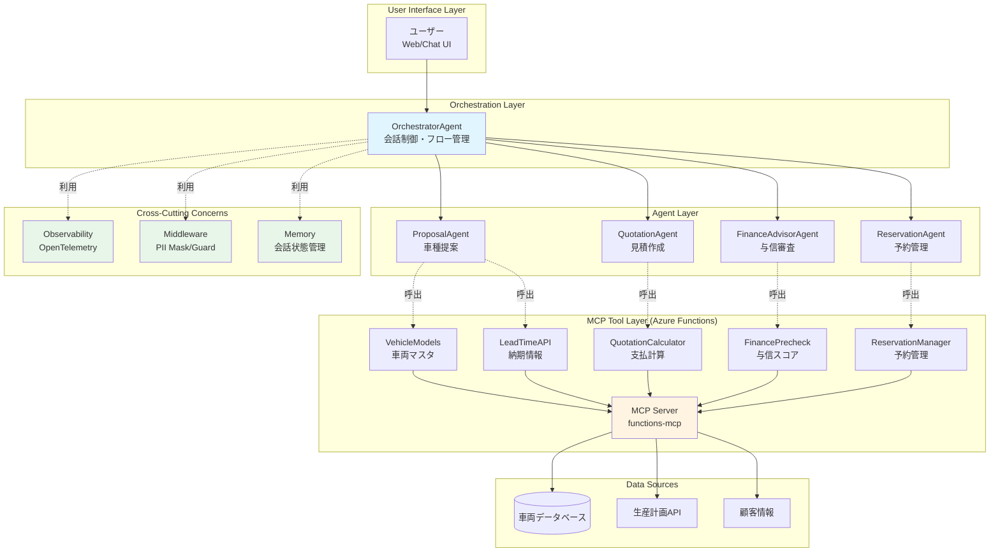
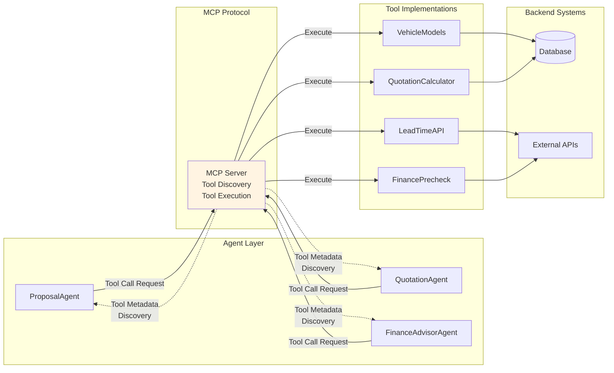
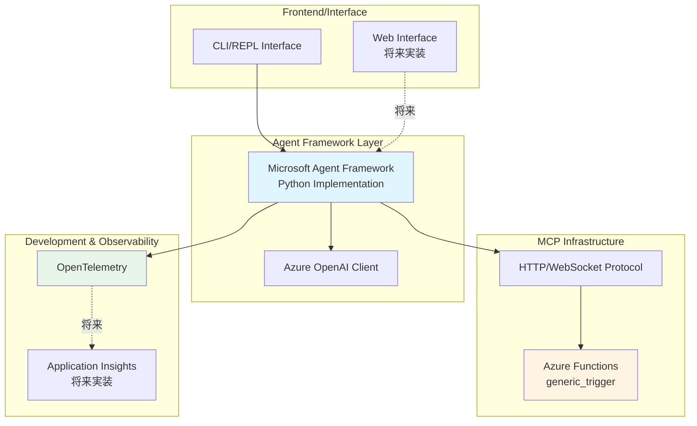

<!--
再編版 2025-10-05
主な変更点:
- 章番号付与 / 用語統一 (ProposalAgent=お客様提案エージェント, FinanceAdvisorAgent 統一)
- 用語集追加
- Appendix B のエージェント命名統一
- PoC (functions-mcp) との整合メモ追加
-->

# 0. システム概要

## 0.1 アーキテクチャ概要

本PoC (Proof of Concept) システムは、Microsoft Agent Framework を用いた自動車購入を検討している人に向けたマルチエージェントシステムです。顧客の要望に応じて車種提案、見積作成、与信審査、予約管理を自律的に実行する複数の専門エージェントと、それらを統括するオーケストレーターエージェントで構成されています。

### システムアーキテクチャ図



### MCP (Model Context Protocol) とエージェントの関係性

このシステムでは、**MCP (Model Context Protocol)** が外部ツールとエージェント間の標準インターフェースとして機能します：



**MCP の主な機能**:
1. **Tool Discovery**: エージェントが利用可能なツール一覧とメタデータ（名前、パラメータ、説明）を取得
2. **標準化されたツール実行**: 統一されたプロトコルで各ツールを呼び出し
3. **セキュリティ**: ツール実行の承認フロー、アクセス制御を一元管理
4. **拡張性**: 新しいツールを追加する際、エージェント側のコード変更が不要

### エージェントとMCPツールの関係性

各専門エージェントは、MCPプロトコルを通じて必要なツールのみを呼び出します：

| エージェント | 使用するMCPツール | 目的 |
|-------------|------------------|------|
| **ProposalAgent** | VehicleModels, LeadTimeAPI | 車種候補の抽出と納期情報の取得 |
| **QuotationAgent** | QuotationCalculator | ローン支払プランの計算 |
| **FinanceAdvisorAgent** | FinancePrecheck | 簡易与信スコアリング |
| **ReservationAgent** | ReservationManager | 試乗・商談予約の管理 |
| **OrchestratorAgent** | （間接的に全ツール） | 専門エージェント経由で全機能を統合 |

### 実装技術スタック



**主要技術**:
- **Agent Framework**: Microsoft Agent Framework (Python)
- **LLM**: Azure OpenAI (GPT-4o)
- **MCP Server**: Azure Functions (Python, generic_trigger)
- **Protocol**: MCP over HTTP/WebSocket
- **Observability**: OpenTelemetry (計画中)
- **Memory**: Agent Framework 内蔵の会話状態管理

## 0.2 主要コンポーネント

### エージェント層
- **OrchestratorAgent**: 全体フロー制御、マルチターン会話管理
- **ProposalAgent**: 顧客要件の正規化と車種候補の推奨
- **QuotationAgent**: サブスクリプション料金の計算とプラン比較
- **FinanceAdvisorAgent**: 与信審査と承認判定
- **ReservationAgent**: 試乗・商談予約の調整

### MCPツール層 (Azure Functions)
- **VehicleModels**: 車両マスタデータの提供
- **LeadTimeAPI**: 納期情報の取得
- **QuotationCalculator**: 月額料金計算エンジン
- **FinancePrecheck**: 簡易与信スコアリング
- **ReservationManager**: 予約の作成と競合検査

### 横断的機能
- **Memory**: 会話履歴とコンテキストの保持
- **Middleware**: PII マスキング、ツールガード、リトライ制御
- **Observability**: トレーシング、メトリクス収集（OpenTelemetry）

---

# 1. はじめに

本記事は Microsoft の次世代 **Agent Framework** を用いて、自動車販売店（以下「ディーラー」）の業務を AI エージェントで段階的に再構築するための実践ガイドです。概念整理 → アーキテクチャ → 実装パターン → 運用/改善 の流れで “全体像と最初の一歩” を同時に掴める構成へ再編しました。

想定読者:
- 既に LLM / LangChain / Semantic Kernel などで PoC を経験し、運用可能な基盤を検討中の方
- ディーラー業務（在庫・納期、見積、試乗/整備予約、融資、顧客フォロー）の AI 利用を設計/実装するアーキテクト & エンジニア

読後に得られること:
1. Agent Framework のコア概念と他フレームワークとの差異の理解
2. ディーラー業務をマルチエージェント/ワークフローへ写像する思考手順
3. Python/.NET 併用を見据えた実装開始パターン
4. 観測性・ミドルウェア・HITL (Human-in-the-Loop) を初期フェーズから組み込む勘所

---

# 2. 用語とコンセプト整理 (Glossary)

| 用語 | 本記事での意味 | 備考 |
|------|-----------------|------|
| ProposalAgent (お客様提案エージェント) | 顧客要件を正規化し在庫/納期/候補車種を提示する中核エージェント | 旧称: 在庫・受注確認/納期取得 機能を包含 |
| FinanceAdvisorAgent | 見積プラン比較 + 簡易与信 (境界は HITL 分岐) | 旧: FinanceAgent, FinancePrecheck ツールを利用 |
| ReservationAgent | 試乗/商談予約の生成と競合調整 | ReservationManager ツール |
| OrchestratorAgent | 全体フローの計画・分岐・再試行管理 | Workflow Graph 上位 |
| MCP (Model Context Protocol) | ツール/外部サービスをメタ情報付きで公開する標準プロトコル | functions-mcp で PoC 実装 |
| generic_trigger | Azure Functions 上で MCP ツール形態を公開するトリガ (Preview) | PoC で使用 |
| Tool Discovery | MCP サーバが提供するツール仕様列挙 | /mcp/discover (拡張予定) |
| Checkpoint | ワークフロー中間状態の保存点 | HITL / リトライ制御に活用 |
| Observability | OpenTelemetry によるトレース/メトリクス/ログ統合 | Token/Latency/エラー起点分析 |

---

# 3. Agent Framework の位置づけと差別化ポイント

| 観点 | Agent Framework | LangChain | Semantic Kernel |
|------|-----------------|-----------|-----------------|
| 言語サポート | Python / .NET で概念整合 | Python中心 | .NET/Python だが API 差異あり |
| ワークフロー | グラフ/チェックポイント/タイムトラベル | Runnable Chains / Graph (LCEL) | Planner + Pipeline (限定) |
| ミドルウェア | 多段階 (リクエスト/レスポンス/例外/承認) フック | Callback Handler (観測寄り) | Filter (Invoke/Prompt) |
| 観測性 | OpenTelemetry 標準統合 | コミュニティ拡張 | 拡張で実現 |
| 実験領域 | Labs (ベンチ/研究) | Experimental Modules | なし (Issue/PR ベース) |
| API 一貫性 | 共通概念 (Agent, Tool, Workflow) | モジュール多層 (Wrapper多数) | 機能拡張で複雑化 |

実務で「これは効くな」と感じる差別化ポイントは次の通りです:
- マルチランタイム (.NET + Python) 抽象: 既存業務システム (.NET) × データ分析や PoC (Python) を同じメンタルモデルで橋渡し
- グラフ型ワークフロー + チェックポイント + HITL: 審査や段階承認が混ざる販売/融資プロセスと親和性高いですね
- ミドルウェア層での統制: PII マスク / 不正ツール抑止 / ポリシーチェックを“後付け”でなく“設計時組み込み”にできる
- OpenTelemetry 標準統合: マルチエージェント連携の「どこで止まった？」を即座に追える可観測性

---

# 4. MCP (Model Context Protocol) 概要と活用指針

Agent Framework はエージェント本体と「外部ツール」を結ぶ仕組みを豊富に備えています。その中で Model Context Protocol（MCP）は、外部サービス／ツールを標準化されたプロトコルで公開し、エージェントが動的に発見・利用できる仕組みを指します。本章では PoC 向けに MCP の役割と Agent Framework 上での使い方を簡潔に解説します。

- MCP の役割（ざっくり）:
	- ツール公開: 外部サービスを MCP サーバとして公開し、ツール（関数）を一覧化できる
	- 発見とメタデータ: ツールの名前・引数仕様・許可ポリシー等をメタ情報として渡す
	- 実行プロトコル: WebSocket / HTTP 等でツール実行を仲介し、入出力をやり取りする

- Agent Framework 側でできること:
	- Agent に MCP ベースの Tool を登録でき、LLM がツール呼び出しを指示すると実行される
	- サーバの自動発見や `require_approval`（実行ごとに人の承認を要求）などのセキュリティ設定をサポート
	- ツール呼び出しはフレームワークのミドルウェア（トレーシング／承認／入力検証）と連携して安全に行える

- 実装イメージ（概念）:
	- Python 側では `McpTool` / `HostedMCPTool` 等の定義を通して MCP サーバを参照するツールを生成し、`ChatAgent(..., tools=[mcp_tool])` として登録します。
	- .NET 側のサンプルとして `dotnet/samples/GettingStarted/ModelContextProtocol/FoundryAgent_Hosted_MCP/Program.cs` に MCP を使う例があります（リポジトリのサンプル参照）。

- 運用上の注意（PoC 向け）:
	- PoC では MCP サーバをモック／ローカルで用意して動作確認するのが手早いです。実運用時はツール承認ワークフローやツールホワイトリストを必ず設定してください。
	- OpenTelemetry 等のトレースをツール呼び出しにまで伝搬させるとデバッグと監査が格段に楽になります。

この仕組みにより、Agent は自己完結せずに既存の社内 API や計算サービスを安全に活用でき、機能の拡張や運用ポリシー反映が容易になります。


# 5. ディーラー業務ドメインのエージェント化マッピング

この節では実装や具体的なツール名は出さず、業務をどのような「役割（役目）」に分解するかを示します。実装は別稿で扱うため、ここでは設計上の責務に集中します。

代表的な役割と責務 (概念):

| 役割 | 主責務 | 境界 (他役割との境) |
|------|---------|----------------------|
| お客様提案エージェント (ProposalAgent) | 要件正規化 / 候補生成 (モデル/グレード/エンジン) / 納期差分の説明 | 見積計算ロジックは FinanceAdvisorAgent へ委譲 |
| 見積作成 (Quotation 一次計算) | 価格, 割引, 月次ローン候補計算 | 与信スコア判断は FinanceAdvisorAgent |
| 融資事前審査 (FinanceAdvisorAgent) | 簡易与信 + 境界スコア HITL 分岐 | 最終契約与信は外部 FSS システム |
| 予約管理 (ReservationAgent) | 試乗/商談予約確定・競合回避 | 顧客体験の最終案内は OrchestratorAgent |
| アフターサービス支援 | 整備履歴/部品データ参照, リテンション提案 | 購入前フェーズとはコンテキスト分離 |
| CRM フォロー | 次回接点生成/キャンペーン適用 | 在庫/納期の最新性は ProposalAgent に問い合わせ |
| 業務統括 (OrchestratorAgent) | ワークフロー分岐/再試行/SLA 管理 | 各専門エージェント内部戦略には介入しない |

横断機能 (Cross Cutting): 会話メモリ / コンプライアンス (PII・ポリシー) / 根拠データ取得 (Retrieval) / 観測性 / バージョン管理 / テレメトリ駆動改善

---

# 6. アーキテクチャ全体像

```
User (Web / Chat UI)
	 │
	 ▼
OrchestratorAgent ── Graph Workflow Engine
	 │            │            │            │
	 │            │            │            └─ ServiceAgent
	 │            │            └─ FinanceAgent (Human Approval branch)
		│            └─ Availability Tool → Retrieval (Model Specs Vector Store, LeadTime API)
	 └─ QuotationAgent → Pricing Tool, Campaign Tool
			 │
			 └─ TestDriveAgent (予約)

Cross Cutting:
  Middleware (PII Mask, Tool Guard, Retry)
  Memory (Conversation + SharedState)
  Observability (OpenTelemetry)
  Labs (Benchmarking A/B of prompt variants)
```
 
この図に当てはまる代表的ワークフローパターンは次のとおりです。どれも段階導入できますね。
- Manager-Worker: Orchestrator が適材エージェントにタスク分配
- Retrieval Grounded Answering: Availability Tool (納期取得API) を使って根拠データを取得し、ProposalAgent が仕様/納期の根拠付き回答を生成
- Human-in-the-Loop: FinanceAgent の“グレー判定”で人の承認に分岐
- Tool-augmented Loop: QuotationAgent が最適支払プランをループ探索

---

# 7. コア概念と本ユースケース対応表

| Framework 概念 | 説明 | 本ユースケース適用 |
|----------------|------|--------------------|
| Agent | LLM 指示/ツールを持つ実行主体 | ProposalAgent など専門職化 (AvailabilityTool を利用) |
| Tools / Function | 外部システム呼び出し関数 | 車両マスタ/受注可能マスタ, 融資API, 予約API |
| Workflow / Graph | 複数エージェント・関数のオーケストレーション | DealerSalesWorkflow |
| Middleware | リクエスト/レスポンス/例外/承認フィルタ | PII マスク, Rate, ツール白黒リスト |
| Memory / State | 会話履歴 + 共有状態 | 顧客嗜好, 見積ドラフト, スコア結果 |
| Observability | OpenTelemetry 連携 | span=agent 呼び出し + tool latency |
| Labs | 実験的パッケージ | Prompt 版数ベンチ, RL 改善実験 |

---

# 8. エージェント設計 (Instructions & Tool Mapping)

本章では「実装コード」を提示せず、各エージェントの設計観点（目的 / 期待入力 / 使用ツール / 出力構造 / Instructions ドラフト / ガード条件）に限定して整理します。PoC ではまず Proposal / Quotation / Finance / Reservation / Orchestrator を最小集合として確立し、Audit は Finance の explainability 強化フェーズで追加する想定です。

## 8.1 設計ポリシー
1. Instructions は「役割宣言」「入出力期待」「ツール利用ルール」「出力フォーマット」「制約」の5ブロックで構成
2. すべてのツール呼び出しは必要最小回数 (冪等 / キャッシュ前提) を明示
3. 出力は JSON (最終提示用の自然文は別フィールド) を第一クラス化し、Orchestrator が機械的に結合可能にする
4. Finance 系は境界値 (threshold ± margin) をシグナル化し HITL 分岐を容易化
5. ツール列挙は現行 PoC (付録 A) と一致。将来拡張は OPTIONAL として記述

共通出力メタフィールド案:
- metadata.version: prompt/agent 設計バージョン (semver)
- metadata.generated_at: ISO8601
- metadata.source_tools: 実際に呼んだツール一覧 (順序)

## 8.2 ProposalAgent (お客様提案)
目的: ユーザー要求 (用途/人数/予算/納期優先度/燃費志向 等) を正規化し、候補車種 (モデル/グレード/エンジン) を 2–3 件推奨し根拠 (納期/予算/特徴) を付与。

使用ツール:
- VehicleModels (必須 / 一覧取得)
- LeadTimeAPI (必要時 / 納期比較) ※ include_lead_time オプション将来対応 (拡張 D)

期待入力コンテキスト:
| Key | 型 | 必須 | 説明 |
|-----|----|------|------|
| user_query | string | ✅ | 自然文要求 |
| budget_max | number | ⭕ | 上限予算 (不在なら “推定” ラベル) |
| passenger_count | int | ⭕ | 乗車人数 |
| priority | string | ⭕ | 'lead_time' / 'price' / 'balance' |
| fuel_pref | string | ⭕ | 'hybrid' / 'gasoline' / 'ev' / 'any' |

出力(JSON) 例 (簡略):
```
{
  "recommendations": [
    {"model_id": "PRIUS", "grade_id": "U", "engine_id": "2.0HV-A", "reasons": ["短納期6週", "燃費優先"], "est_lead_weeks": 6},
    {"model_id": "CROWN", "grade_id": "Sport", "engine_id": "2.4Turbo-HV", "reasons": ["走行性能", "許容納期8週"], "est_lead_weeks": 8}
  ],
  "normalized_requirements": {"budget_max": 4200000, "priority": "lead_time"},
  "next_action_hint": "見積詳細へ進むか、用途詳細(年間走行距離)を補足してください",
  "metadata": {"version": "1.0.0", "source_tools": ["VehicleModels", "LeadTimeAPI"], "generated_at": "..."}
}
```

Instructions ドラフト (要約):
- 役割: 上位 2–3 車種の組合せ (モデル/グレード/エンジン) を納期と適合理由で提示
- 手順:
  1. 要求正規化 (欠損項目は推定し reason を付記)
  2. VehicleModels から候補フィルタ (燃費/人数/概算価格帯)
  3. priority が 'lead_time' の場合 LeadTimeAPI 呼び出し → 納期ソート
  4. 重みスコア = w_price + w_lead + w_pref (内部計算は説明のみ) で上位抽出
  5. JSON 出力生成 (自然文は reasons 配列に粒度小さく分解)
- 制約: 同系列グレード重複は避け多様性確保 / 推定値は reason に "assumed" タグ

## 8.3 QuotationAgent
目的: 入力候補 (単一または複数エンジン構成) に対し複数ローン期間で支払パターンを計算しランキング + 推奨1案。

使用ツール:
- QuotationCalculator (必須)
  - 取得後、LLM 側は計算結果の再計算を行わず説明整形のみ

入力コンテキスト (前段 Proposal から受領):
| Key | 型 | 必須 | 説明 |
|-----|----|------|------|
| selected_engines | array<string> | ✅ | engine_id の候補1–3 |
| down_payment_hint | number | ⭕ | 頭金目安 |
| budget_max | number | ⭕ | 月額許容ライン (任意) |

出力(JSON) 例 (要素): plans[], recommended_plan, rationale[], constraint_flags[]

Instructions 要点:
- QuotationCalculator を 1 回だけ呼び支払パターン取得
- 各 plan に (monthly, total, term, down_payment, residual(optional)) を保持
- budget_max 超過プランには flag=OVER_BUDGET を付加
- 推奨案は (1) 月額 <= 予算 かつ (2) total 最小 の優先ルール / 同値なら短期優先
- 出力 rationale[] は "選定理由: 指標" の短文単位

## 8.4 FinanceAdvisorAgent
目的: 見積金額と顧客属性から簡易スコアリング、判定 (approved / manual_review / reject) を出す。

使用ツール:
- FinancePrecheck (必須)
- QuotationCalculator (OPTIONAL: プラン総額再確認時)

入力コンテキスト:
| Key | 型 | 必須 | 説明 |
|-----|----|------|------|
| selected_plan | object | ✅ | QuotationAgent 推奨プラン |
| customer_profile | object | ✅ | income, age, existing_debt, dependents など |

出力フィールド (拡張 A 適用後想定):
```
{
  "score": 712,
  "rating": "A",            // A/B/C
  "decision": "approved",    // approved | manual_review | reject
  "factors": [                // A: 追加予定 (explainability)
    {"name": "income_ratio", "impact": +12},
    {"name": "debt_penalty", "impact": -5}
  ],
  "manual_review_reason": null,
  "metadata": {"version": "1.0.0", "source_tools": ["FinancePrecheck"], "generated_at": "..."}
}
```

Instructions 要点:
- FinancePrecheck の結果そのままを改変せずラップ
- スコア閾値定義 (例): A≥680, B 620–679, C<620
- margin=±5 の境界で decision=manual_review に変更し理由設定
- LLM が新規計算を行わない (数値生成禁止 / 例外: 文字列整形)

## 8.5 ReservationAgent
目的: 試乗/商談予約希望 (複数候補時刻) と選択エンジン情報から競合検査し確定 or 代替案返却。

使用ツール:
- ReservationManager (必須)

入力コンテキスト:
| Key | 型 | 必須 | 説明 |
|-----|----|------|------|
| customer_id | string | ✅ | 顧客ID |
| engine_id | string | ✅ | 予約対象エンジン |
| preferred_times | array<string> | ✅ | ISO8601 候補 1–3 |

出力: reservation_id / confirmed(bool) / chosen_time / alternatives[] / conflicts[] / next_action

Instructions 要点:
- ReservationManager 一括呼び → confirmed=false の場合 alternatives をユーザへ提示
- 過度な推測 ("勝手に別日設定") 禁止。必ず alternatives 明示
- 再試行を促す自然文は next_action に格納し JSON 外自然文は避ける

## 8.6 OrchestratorAgent
目的: 各専門エージェントの実行と不足属性質問、分岐 (HITL / 予約) 管理。

利用ツール (間接): VehicleModels, LeadTimeAPI, QuotationCalculator, FinancePrecheck, ReservationManager

主要ロジック (設計粒度):
1. 前提チェック -> 欠損 (budget_max, fuel_pref 等) があれば質問生成 (質問テンプレ: JSON {"need":"budget_max","question":"..."})
2. ProposalAgent 呼出 → 候補 < 1 の場合: fuel_pref 緩和再試行
3. QuotationAgent → recommended_plan 取得
4. FinanceAdvisorAgent → decision=manual_review なら Checkpoint + human_approval state 発火
5. ReservationAgent (ユーザが希望した場合のみ) → 予約結果マージ
6. 最終集約 JSON (agents.proposal / quotation / finance / reservation) + next_suggested_step

Instructions 要点:
- 途中生成した中間自然文は保持せず構造化結果を優先
- 不足属性は 2 回まで再質問、それ以上は "insufficient_context" エラーを返す
- 人承認後の再開位置 (checkpoint_id) を metadata に格納

出力メタ:
```
{
  "workflow_state": "completed|awaiting_user|awaiting_approval",
  "agents": { ... },
  "metadata": {"checkpoint_id": "ckpt_...", "version": "1.0.0"}
}
```

## 8.6.1 Multi-Turn 対話の実装例
設計フェーズで定義した OrchestratorAgent を元に、実際に Python で multi-turn 会話を可能にした実装例を示します。ポイントは `AgentThread` を使った会話コンテキストの保持とツール関数の一括定義です。

```python
# agents/orchestrator_agent.py より抜粋
async def start_chat(self, initial_query: ProposalQuery) -> Dict[str, Any]:
    # フレームワークモード判定
    mode = os.getenv("AGENT_FRAMEWORK_MODE", "procedural").lower()
    if mode != "framework":
        # 従来の単発実行
        return {"assistant_output": "(procedural single turn)",
                "machine_output": await self._run_procedural(initial_query)}
    # 初期プロンプト生成と一度だけ thread を生成
    seed_msg = f"初期要求: {initial_query.user_query} \n予算: {initial_query.budget_max}..."
    return await self._framework_turn(seed_msg)

async def chat_turn(self, user_message: str) -> Dict[str, Any]:
    # フレームワークモード時は同一 thread で successive turns
    return await self._framework_turn(user_message)
```

### Multi-Turn パターンの要点
- `agent.get_new_thread()` で作成した同一 `thread` を全ターンで再利用し、LLM が以前のやりとりを参照可能にする
- ツール関数 (`call_proposal`, `call_quotation` など) は一度だけ `create_agent(..., tools=[...])` で登録
- 環境変数 `AGENT_FRAMEWORK_MODE=framework` で procedural ⇔ framework モードを切り替え

### 対話 REPL の活用例
実装検証用に簡易的な REPL ランナーを追加しました。PowerShell で以下のように実行すると対話形式でチャットできます。:

```powershell
$env:AGENT_FRAMEWORK_MODE="framework"
python orchestrator_chat_repl.py --query "家族4人 ハイブリッド 納期短め 予算400万" --priority lead_time
```

- `/json` で最新の `machine_output` を表示
- `/exit` で終了

この実装により、ユーザーの追加質問や別エンジンで再見積りなど、対話を継続しながらフローを動的に制御可能になります。

## 8.7 AuditAgent (将来)
目的: FinanceAdvisorAgent の factors[] 検証 / 説明文章正規化 / 監査ログ付加。

使用ツール:
- FinancePrecheck (read-only)

Instructions 概要:
- factors[].impact の符号・範囲チェック (異常時 anomaly_flags[])
- 説明テンプレ適用 ("要因:影響値" の一覧) を explanation_markdown に生成
- 監査出力: {score, rating, top_positive_factor, top_negative_factor, anomalies[]}

## 8.8 Cross-Cutting Instruction テンプレ
| テンプレ | 用途 | サンプル |
|----------|------|----------|
| REQUIRE_JSON | LLM 出力を JSON 固定 | "出力は妥当な JSON。余分なテキスト禁止" |
| ASK_MISSING | 欠損属性質問 | "以下の属性が不足: {{keys}}. 各1行質問を JSON 配列で返せ" |
| STOP_ON_AMBIGUITY | あいまい要求の早期停止 | "意図が二義的なら 'need_clarification' を返す" |

---

本章の設計を実装へ落とし込む際は、付録 A のツール仕様およびロードマップ (A〜H) を参照し、Schema 導入 (F) → Finance explainability (A) → Reservation 入力緩和 (B) の順で着手すると整合性と効果が高い順序になります。

---

# 9. Human-in-the-Loop デザイン詳細
融資や高額契約など“失敗コストの高い判断”には人が最終ゲートに入るべき場面がありますよね。条件付き承認フローをもう少し具体化します:
条件付き承認フロー例:
1. FinanceAgent が結果 grade=B かつ score_margin<5 を返却
2. Workflow が checkpoint 保存 → human_approval ノードへ遷移
3. オペレータ UI が候補車両/見積/スコア根拠を表示
4. 承認/差戻し結果を context に書戻し → 次ノード (TestDriveAgent or 再見積)

プロダクション向けの追加考慮:
- Checkpoint 永続化 (Redis / Cosmos DB)
- Approval SLA とタイムアウト再ルーティング
- 監査ログ (誰が承認したか) → OpenTelemetry Attributes

---

# 10. Retrieval Grounding 戦略
“それ本当に正しいの？”に答えるには根拠データをどう供給するかが命です。種類ごとに保管と検索の方針を切り分けます。
| データタイプ | 例 | アクセス戦略 | メタデータ |
|--------------|----|--------------|------------|
| 車両仕様 | 車体寸法, 燃費 | 定期 ETL -> Vector Store (OpenAI Embeddings 等) | model_year, trim |
| 注文可能/生産ステータス | 受注枠, 工場稼働率 | RDB + 生産計画API + キャッシュ | build_slot, plant_utilization |
| キャンペーン | 割引条件 | KV/Cache + 埋め込み (文面検索) | start/end, priority |
| FAQ/ナレッジ | 保険, メンテ | Vector Store | category |

Grounding の大まかな手順:
1. クエリ分類 (注文可能/仕様/FAQ)
2. 該当ソース検索 (structured + semantic ハイブリッド)
3. コンテキスト圧縮 (ranking / dedupe)
4. Agent プロンプトへ挿入 (relevance citation)
5. 回答 JSON に引用インデックス付与

---

# 11. ミドルウェア活用パターン
ミドルウェアは“高トラフィック後で巻き戻せない”系の制御を集中管理できます。代表的なパターンを並べておきます。
- PII マスキング (入力/出力)
- Tool Call ホワイトリスト + レート制御
- 逸脱検知 (モデル出力 → policy 正規化)
- Retry with Backoff (特定ツール失敗時のみ)
- Cost Logging (token 使用量集計 → span attribute)

---

# 12. 観測性と SRE 視点 KPI
運用品質を“感覚”でなくメトリクスで語るための指標例です。最初は 3～4 個に絞っても良いですね。
| KPI | 説明 | 取得例 |
|-----|------|--------|
| Workflow Latency (P50/P95) | end-to-end | Trace Aggregation |
| Agent Step Tokens | モデル利用量 | Span Attributes tokens_input/output |
| Tool Error Rate | 外部API 失敗割合 | Metric Counter error/tool_name |
| Approval Turnaround | 承認時間 | span event approval.start/end |
| Retrieval Precision Proxy | 関連ドキュ件数/総件数 | log/metric custom |

---

# 13. 品質 / リスク管理
よくある落とし穴と、最初に打てる“安価な”緩和施策です。段階的に強化していけば大丈夫です。
| リスク | 緩和策 |
|--------|--------|
| 幻覚 (Hallucination) | Retrieval grounding + citation required check ミドルウェア |
| PII 漏洩 | マスキング + 出力検査 + redact span logs |
| 不正確な見積 | 計算ルールを deterministic 関数化し LLM は説明のみ |
| 承認抜け | Human ノード必須判定 + SLA タイムアウト再ルート |
| ツール濫用 | Per-tool rate limit + allowlist middleware |

---

# 14. 段階的導入ロードマップ
全部を一気に入れようとすると失敗しがちなので、フェーズを意識してスコープを切りましょう。
1. PoC: Availability (注文/納期) + Quotation + Observability
2. Pilot: Finance(HITL) + TestDrive + 基本ミドルウェア
3. Prod v1: Full Workflow + Retrieval + KPI Dashboard
4. Prod v2: Labs活用 (Prompt Variant A/B) + Cost最適化
5. Continuous: RLHF / Feedback 収集サイクル

---

# 15. 今後の拡張アイデア
ここまで来ると“次はどこで差別化するか”という話になりますね。いくつかの方向性を提案します。
- Multi-modal (画像: 車両傷評価)
- 音声 (入電 → 自動要約 → エージェント処理)
- Edge キャッシュ (人気車種スペック回答高速化)
- Autonomous Improvement (Labs で自動プロンプト評価)

---

# 16. まとめ
Microsoft Agent Framework は、ディーラー業務のように「多役割」「承認付き」「根拠要求」「監査が必須」といった複雑さを内包するプロセスにしっかりフィットする基盤です。小さな 2 エージェント構成から始め、段階的に HITL・Retrieval・Observability を足していくことで“停止しづらく、説明可能で、改善しやすい”システムへ育てられます。焦らず育てていきましょう。

次の一歩（推奨順）:
1. 社内 API / データソースのツール化候補を棚卸し
2. 最小ワークフロー (Availability → Quotation) をローカルで試作
3. OpenTelemetry Collector + 簡易ダッシュボード導入
4. Finance 判定の HITL 分岐 + PII マスクミドルウェア実装
5. Retrieval Grounding を導入し Hallucination 検知ルールを試す

ご質問や「こういう拡張は？」などあれば気軽にコメントください。次回は“実データ接続と Labs を活用した評価ループ”を掘り下げる予定です。お楽しみに。

---

（注）掲載コードは概念例です。実際の API 名 / パッケージ名はリリース状況に応じて調整してくださいね。

---

## 付録 A: 現在の PoC 実装済み MCP ツール概要 (functions-mcp)

リポジトリ内 `functions-mcp/` で Azure Functions (Python, generic_trigger) として公開しているツールの現況を整理します。この記事冒頭の概念設計と対応付けがしやすいよう、入力/出力の要点とユースケースを併記しました。

| ツール名 | 目的 | 主な入力 (toolProperties) | 代表出力フィールド | 主ユースケース |
|----------|------|--------------------------|--------------------|----------------|
| VehicleModels | モデル/グレード/エンジン一覧取得 | なし | vehicle_models[], total_* | 初期候補抽出、要件ヒアリング補助 |
| LeadTimeAPI | モデル毎の納期 + 製造スロット情報 | model_ids (array, 必須) | items[].grades[].engine_options[].est_lead_weeks | 納期優先ソート、早期納車提案 |
| QuotationCalculator | ローン支払パターン算出 | engine_id / vehicle_price, down_payment, terms[], interest_rate_percent | plans[], recommended_plan | 支払比較表生成、最適プラン提示 |
| FinancePrecheck | 簡易与信スコアリング | income, requested_amount (+ age 等任意) | score, rating, approved | 自動承認/人承認分岐判定 |
| ReservationManager | 試乗/サービス予約作成 | customer_id, vehicle_id, grade_id, engine_id, preferred_times[] | reservation_id, confirmed, conflicts | 来店確定/スケジュール調整 |

HTTP 経由での統合テストを容易にするため `/api/mcp/call` による汎用ディスパッチ ( {"tool": "ToolName", "input": {...}} ) も同居させています。将来的に純粋な MCP トリガーのみに統一する場合はこの互換エンドポイントを段階的に非推奨へ移行してください。

### ツール間の自然なチェーン例
1. VehicleModels → 粗い候補 (価格帯 / ボディタイプ / ハイブリッド有無)
2. LeadTimeAPI → 納期最短順位付け
3. QuotationCalculator → 各最有力エンジン構成の 36/48/60 ヶ月プラン比較
4. FinancePrecheck → 与信可否 (score) に基づく条件付き承認
5. ReservationManager → 試乗/商談日時確定

### 改善予定 / 提案中の拡張（ロードマップ抜粋）
| ID | 項目 | 内容 | 目的 | 優先度 |
|----|------|------|------|--------|
| A | FinancePrecheck 出力拡張 | factors[] （スコア要因内訳） | 説明責任 / 監査 | 高 |
| B | ReservationManager 入力緩和 | engine_id から vehicle_id/grade_id 自動補完 | UX 改善 | 高 |
| C | QuotationCalculator メタ情報 | principal / price_source を明示 | プラン根拠 | 中 |
| D | VehicleModels オプション | include_lead_time=true で LeadTimeAPI 内部連携 | API 呼出削減 | 中 |
| E | /mcp/discover 精緻化 | 正確な required/description/型 & JSON Schema 参照 | 自動UI最適化 | 中 |
| F | schemas/ 導入 | 入出力 JSON Schema 管理 | バリデーション | 中 |
| G | 追加テスト | handlers 単体/境界テスト強化 | 品質/回帰防止 | 中 |
| H | Orchestrator プロンプトテンプレ | 代表フロー (購入/見積/与信/予約) | 再現性向上 | 低〜中 |

---

## 付録 B: 推奨エージェント構成 (PoC → 拡張)

| エージェント | 役割 | 主要ツール | 主な追加ロジック/戦略 |
|---------------|------|-----------|-------------------------|
| ProposalAgent (お客様提案) | 要件→候補提示/納期差分 | VehicleModels, LeadTimeAPI | 納期重みスコア, 価格帯フィルタ |
| FinanceAdvisorAgent | ローンプラン + 与信初期判定 | QuotationCalculator, FinancePrecheck | 支払総額ランキング, 境界スコア判定 |
| ReservationAgent | 試乗/商談予約調整 | ReservationManager | 代替時刻提案, 衝突回避ロジック |
| OrchestratorAgent | 全体フロー計画/実行 | (上記全ツール) | 欠損パラメータ質問, チェーン最適化 |
| AuditAgent (将来) | スコア要因検証/ログ整形 | FinancePrecheck (読み取り) | Explainability 付加 |

最小段階では OrchestratorAgent 単独（全ツール直結）でも可。ただし責務分離後は各領域が独自テスト/評価ループ (Labs, Prompt variant A/B) を回しやすくなり、改善速度が向上します。

---

## 付録 C: サンプル Orchestrator フロー (擬似シーケンス)

```
User Query → OrchestratorAgent
	1) ProductAdvisorAgent 呼出: VehicleModels (+ optional include_lead_time) → 候補
	2) LeadTimeAPI 呼出: 候補 model_ids → 納期ソート
	3) FinanceAdvisorAgent 呼出: QuotationCalculator → プラン集合
	4) FinanceAdvisorAgent 呼出: FinancePrecheck → スコア
			 └ score/rating が境界なら Human Approval 分岐
	5) ReservationAgent 呼出: ReservationManager → 予約確定 or 代替提示
	6) 統合サマリ + 次アクション (来店案内 / 書類一覧)
```

---

## 付録 D: 今後のテクニカルデッド / リスクメモ

| 項目 | 現状 | リスク | 対応候補 |
|------|------|--------|----------|
| スキーマ検証 | 未導入 | 不正入力で例外/幻覚誘発 | JSON Schema + バリデーションミドルウェア |
| 与信説明責任 | スコアのみ | 根拠不足で審査不透明 | factors[] 出力 & 監査ログ | 
| 予約競合 | 固定スロット1種 | 実運用で多重リクエスト競合 | リトライ+楽観ロック or キュー |
| レート制御 | 未実装 | LLM 暴走ツール連打 | Middleware + トークン窓口制限 |
| 観測性粒度 | 基礎のみ想定 | 根本原因追跡困難 | span 属性: tool_name, engine_id, model_id |

---

## 付録 E: 運用移行前チェックリスト（抜粋）

| カテゴリ | チェック | 状態/メモ |
|----------|----------|-----------|
| 可観測性 | OpenTelemetry Export / トレース相関 |  |
| セキュリティ | PII マスク / Tool Allowlist |  |
| 信頼性 | 主要ツールのリトライポリシー |  |
| スキーマ | JSON Schema バージョン付与 |  |
| HITL | Finance 境界条件分岐テスト |  |
| バージョン管理 | ツールバージョン (semver) 表示 |  |
| コスト | Token / Tool 呼数メトリクス収集 |  |

---

（追加付録は将来の更新時に拡張予定）

