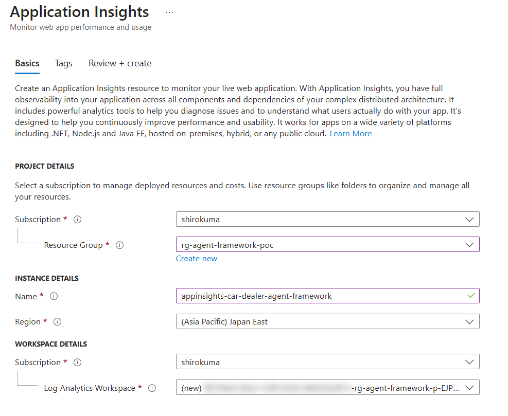
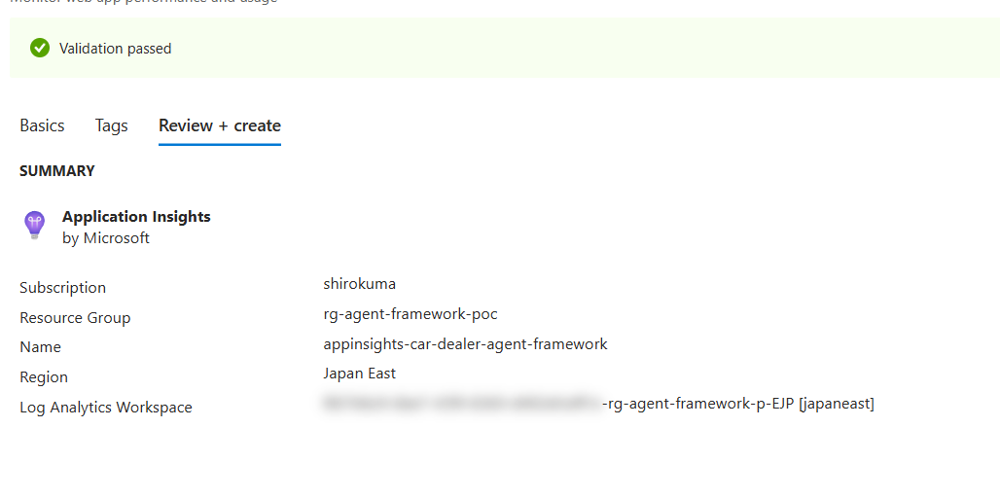
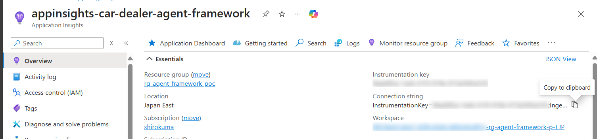

Application Insights リソースを Azure ポータルで作成





Application Insights の接続文字列を取得



し、`.env` に設定

```env
APPLICATIONINSIGHTS_CONNECTION_STRING="InstrumentationKey=f4aa085a-1ee6-41f3-919e-973e5f45a318;IngestionEndpoint=https://japaneast-1.in.applicationinsights.azure.com/;LiveEndpoint=https://japaneast.livediagnostics.monitor.azure.com/;ApplicationId=3dfdc809-f063-42cd-bd86-75cc4af683d6"
```